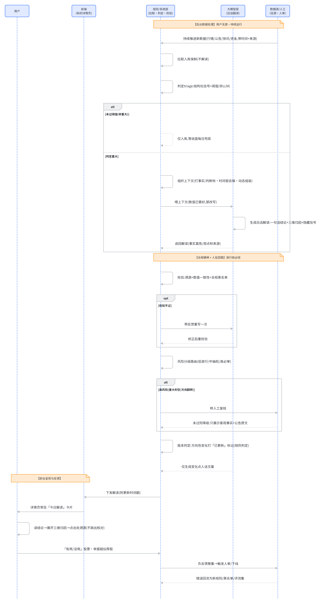

# 标的详情页「当日解读」— 产品需求与设计

> 一款面向普通投资者的**标的当日解读助手**：把关注标的当天的行情、消息、资金三类信号，翻译成看得懂、可溯源的「一句话结论 + 归因」。恪守金融合规红线的**纯解释型信息平权工具**——只解释「已发生了什么」，不预测、不荐股、不做投顾。

## 背景

普通用户从自选/持仓看到当日涨跌后点进标的详情页想弄清情况，但详情页现有内容是行情走势 + 大量面向机构读者的研报摘要与快讯，用户看完仍说不出这只标的当天发生了什么。本项目定义了「当日解读」能力，让普通用户在几分钟内看懂自己关注的标的当天发生了什么。

## 目录结构

```
.
├── docs/
│   ├── requirements.md      # 需求 Spec（背景/价值/场景/功能 4.1–4.10/交互/异常/非功能/非目标/验收/评测）
│   └── research.md          # 竞品与用户行为调研、平台数据能力盘点
├── deliverables/            # 可独立阅读的交付物
│   ├── 01-产品说明.md        # 定位与"产品为何成立"的五条依据
│   ├── 02-运转方式说明.md    # 大模型只做"翻译"、判断归规则与人的完整链路（含时序图）
│   ├── 03-产品原型Demo走查说明.md # 典型用户动线与各异常态表现
│   ├── 04-评测方案.md        # 怎么测：评测集、红线/体验维度、量价信号专项、投放门槛
│   └── 05-成功标准与指标体系.md  # 怎么判定做成：L0–L3 分层标准、指标决策矩阵、放量门控
├── canvas/                  # 思维画布（HTML，可视化的分析与方案）
│   ├── research-overview.html      # 竞品调研概览
│   ├── value-overview-v3.html      # 需求价值一页纸 + 概览
│   ├── data-capability.html        # 平台数据能力 × 风险机会
│   ├── data-pipeline.html          # 拉取→判定→解读 三层链路
│   ├── timeliness-layering.html    # 时效性 × 信息分层
│   ├── hitl.html                   # 人在回路与幻觉控制
│   ├── compliance.html             # 金融合规风险控制
│   ├── swimlane-flow.html          # 信息与数据流转泳道时序图
│   └── eval-plan.html              # 评测方案与投放门槛
└── demo/                    # 可交互原型 Demo（用户读到解读的典型过程）
```

## 核心设计要点

- **三位一体解读**：价格 + 消息/公告 + 资金流向/成交量异动，都翻译成人话；低波动日的量价信号是差异化护城河。
- **诚实归因**：无对应公开消息时坦白说明并给资金/板块线索，不硬凑因果。
- **可信可控**：大模型只负责「表达/翻译」，是否重大、是否合规、是否放行等「判断」交给规则与人（人在回路分级路由）。
- **合规红线**：机制根除荐股/引导交易风险，实质重于形式（免责声明仅作辅助）。
- **评测门槛**：合规违规率、幻觉率、极端场景为一票否决的红线维度；达标才可分级放量投放。

## 说明

本仓库为产品需求与设计资产（需求 Spec、调研、可视化分析与交互原型），用于展示从背景洞察到 MVP 定义、机制设计与评测方案的完整产品思考过程。

## 运转方式时序图

一次解读从平台数据产生到呈现给用户的完整过程（大模型只做"翻译"，判断归规则与人）：



## 在线体验原型 Demo

`demo/` 是纯静态前端产物，**两种方式打开，均不依赖任何内部环境**：

1. **本地打开**：下载仓库后直接用浏览器打开 `demo/index.html`。
2. **在线访问（推荐，可分享）**：在仓库 **Settings → Pages** 中，Source 选择 `main` 分支、根目录（`/root`），保存后即可通过 `https://huguanyu0103.github.io/stock-daily-digest/demo/` 公网访问。
